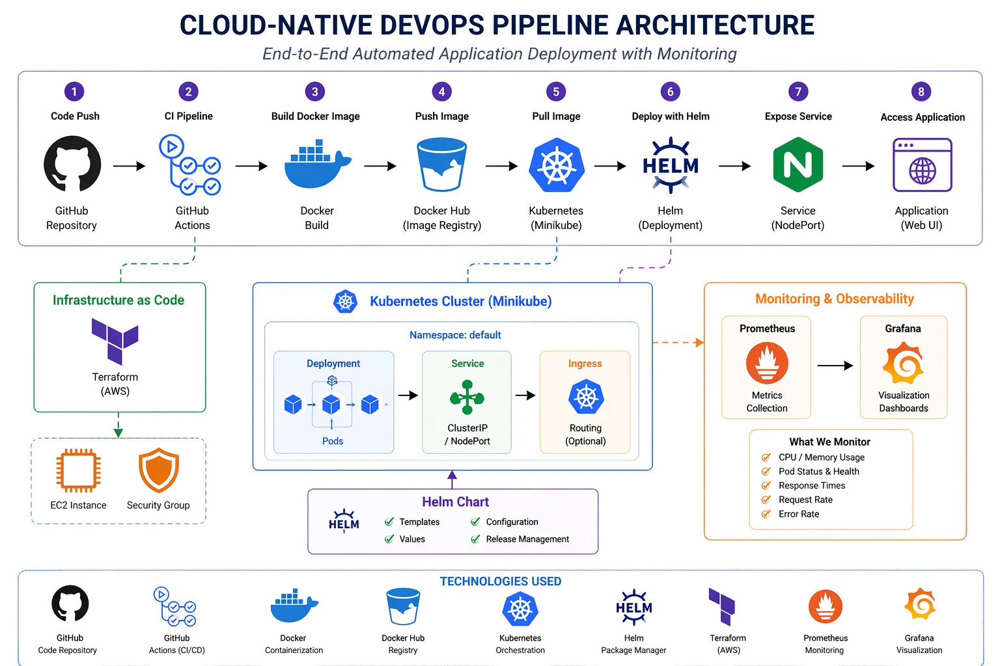
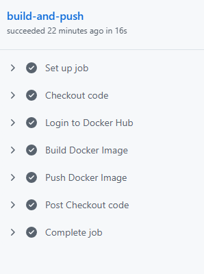
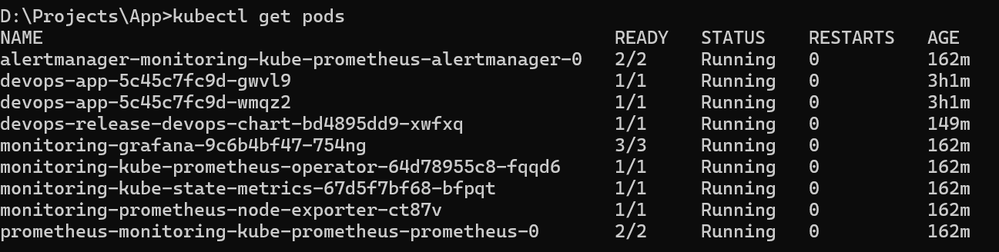
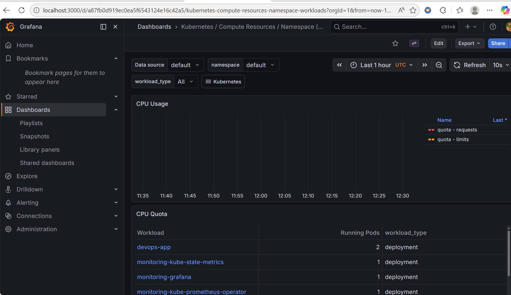

# Cloud-Native DevOps Pipeline Project

## Overview

This projectdemonstrates hands-on experience in building scalable and automated DevOps pipelines using cloud-native tools.

It showcases an end-to-end DevOps pipeline using modern tools and practices including CI/CD, containerization, Kubernetes orchestration, Infrastructure as Code, and monitoring.

The system automates the process of building, packaging, and deploying an application while providing observability through monitoring tools.

---

## Tech Stack

* **CI/CD:** GitHub Actions
* **Containerization:** Docker
* **Container Registry:** Docker Hub
* **Orchestration:** Kubernetes (Minikube)
* **Package Management:** Helm
* **Infrastructure as Code:** Terraform (AWS - EC2 & Security Group)
* **Monitoring:** Prometheus & Grafana

---

## Architecture

###  Architecture Diagram

---

### Workflow

1. Code is pushed to GitHub
2. GitHub Actions builds Docker image
3. Image is pushed to Docker Hub
4. Kubernetes (Minikube) pulls the image
5. Helm deploys the application
6. Service exposes the application
7. Prometheus collects metrics
8. Grafana visualizes system performance

---

## CI/CD Pipeline

---

## Kubernetes Deployment

---

## Monitoring

---

## Features

* Automated Docker image build and push using GitHub Actions
* Infrastructure provisioning using Terraform (EC2 & Security Group)
* Kubernetes deployment with scaling support
* Helm-based deployment management
* Monitoring and observability using Prometheus and Grafana
* Debugged real-world Kubernetes issues (CrashLoopBackOff, probe failures)

---

## Key Learnings

* Built end-to-end CI/CD pipeline
* Worked with Kubernetes and Helm for deployment
* Implemented monitoring and observability
* Debugged Kubernetes issues (CrashLoopBackOff, probes)
* Understood real-world DevOps workflows

---

## Future Improvements

* Add Continuous Deployment (CD)
* Use AWS EKS instead of Minikube
* Implement GitOps (ArgoCD)
* Add automated testing

---

## Author
Sri Varshini Pulla

---
